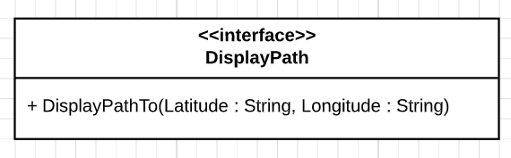

# DisplayPath



This interface holds one action : `DisplayPathTo`

Input arguments : 
- `Latitude`, String, should be a double between -90.0 and 90.0 / *Example : 45.98553878*
- `Longitude`, String, should be a double between -180.0 and 180.0 / *Example : -97.98553878*

## Requiring this interface

```Java

private final String DISPLAY_PATH = "DisplayPath";
private final String DISPLAY_PATH_TO = "DisplayPathTo";

private DependencyInjectionService dependencyInjectionService;

public static void main(String[] args) {
    //Component creation
    Map<String, ServiceId> requiredServices = new HashMap<>();
    requiredServices.put(DISPLAY_PATH, new UDAServiceId(DISPLAY_PATH));

    LocalService<DependencyInjectionService> dependencyInjectionLocalService = 
            ServiceFactory.makeDependencyInjectionService(requiredServices);

    dependencyInjectionService = dependencyInjectionLocalService.getManager().getImplementation();

    UpnpServiceStore.addLocalDevice(
        DeviceFactory.makeLocalDevice(
            "ExampleComponent",
            "Requires DisplayPath",
            1,
            "Manufacturer",
            new LocalService[]{ dependencyInjectionLocalService }
        )
    );

    //Calling the required service
    dependencyInjectionService.getRequired().get(DISPLAY_PATH).execute(
        DISPLAY_PATH_TO,
        Map.of(
            "Longitude", "0.0",
            "Latitude", "0.0",
        )
    );

}

```

## Providing this interface

```Java
@UpnpService(
        serviceId = @UpnpServiceId("DisplayPath"),
        serviceType = @UpnpServiceType(value = "DisplayPath", version = 1)
)
public class ExampleDisplayPathService {

    @UpnpStateVariable
    private String latitude = "";

    @UpnpStateVariable
    private String longitude = "";

    @UpnpAction(name = "DisplayPathTo")
    public void displayPathTo(
            @UpnpInputArgument(name = "Latitude") String latitude,
            @UpnpInputArgument(name = "Longitude") String longitude) {
        this.latitude = latitude;
        this.longitude = longitude;
    }
}
```