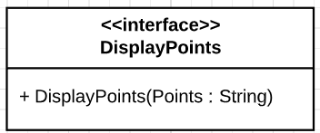

# SetText



This interface holds one action : `DisplayPoints`

Input argument : `Points`, String, should be a set of coordinates in the following format : *latitude1,longitude1 latitude2,longitude2 latitude3,longitude3*.

Examples :
- `3.877565,-4.000397 1.1,-150.366377`
- `0.0,76.0`

## Requiring this interface

```Java

private final String DISPLAY_POINTS = "DisplayPoints";

private DependencyInjectionService dependencyInjectionService;

public static void main(String[] args) {
    //Component creation
    Map<String, ServiceId> requiredServices = new HashMap<>();
    requiredServices.put(DISPLAY_POINTS, new UDAServiceId(DISPLAY_POINTS));

    LocalService<DependencyInjectionService> dependencyInjectionLocalService = 
            ServiceFactory.makeDependencyInjectionService(requiredServices);

    dependencyInjectionService = dependencyInjectionLocalService.getManager().getImplementation();

    UpnpServiceStore.addLocalDevice(
        DeviceFactory.makeLocalDevice(
            "ExampleComponent",
            "Requires DisplayPoints",
            1,
            "Manufacturer",
            new LocalService[]{ dependencyInjectionLocalService }
        )
    );

    //Calling the required service
    dependencyInjectionService.getRequired().get(DISPLAY_POINTS).execute(
        DISPLAY_POINTS,
        Map.of("Points","0.0,0.0 1.1,1.1")
    );

}

```

## Providing this interface

```Java
@UpnpService(
        serviceId = @UpnpServiceId("DisplayPoints"),
        serviceType = @UpnpServiceType(value = "DisplayPoints", version = 1)
)
public class ExampleDisplayPointsService {

    @UpnpStateVariable
    private String points;

    @UpnpAction(name = "DisplayPoints")
    public void displayPoints(@UpnpInputArgument(name = "Points") String points) {
        this.points = points;
    }
}
```