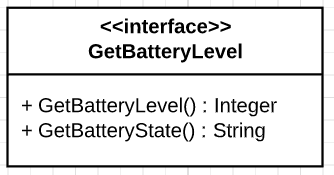

# GetBatteryLevel



1. First action : `GetBatteryLevel`

Output argument : `Level`, Integer, should be between 0 and 100

2. Second action : `GetBatteryState`

Output argument : `State`, String, describes the state of the battery, for example `CHARGING` or `NOTCHARGING`

## Requiring this interface

```Java

private final String GET_BATTERY_LEVEL = "GetBatteryLevel";

private final String GET_BATTERY_STATE = "GetBatteryState";

private DependencyInjectionService dependencyInjectionService;

public static void main(String[] args) {
    //Component creation
    Map<String, ServiceId> requiredServices = new HashMap<>();
    requiredServices.put(GET_BATTERY_LEVEL, new UDAServiceId(GET_BATTERY_LEVEL));

    LocalService<DependencyInjectionService> dependencyInjectionLocalService = 
            ServiceFactory.makeDependencyInjectionService(requiredServices);

    dependencyInjectionService = dependencyInjectionLocalService.getManager().getImplementation();

    UpnpServiceStore.addLocalDevice(
        DeviceFactory.makeLocalDevice(
            "ExampleComponent",
            "Requires GetBatteryLevel",
            1,
            "Manufacturer",
            new LocalService[]{ dependencyInjectionLocalService }
        )
    );

    //Calling the required service
    dependencyInjectionService.getRequired().get(GET_BATTERY_LEVEL).execute(
        GET_BATTERY_LEVEL,
        new HashMap<>(),
        new Consumer<ActionInvocation>() {
            @Override
            public void accept(ActionInvocation actionInvocation) {
                System.out.println(actionInvocation.getOutput("Level").toString() + "%");
            }
        }
    );

}

```

## Providing this interface

```Java
@UpnpService(
        serviceId = @UpnpServiceId("GetBatteryLevel"),
        serviceType = @UpnpServiceType(value = "GetBatteryLevel", version = 1)
)
public class ExampleBatteryLevelService {

    @UpnpStateVariable
    private int level = 0;

    @UpnpStateVariable
    private String state = "NOTCHARGING";

    @UpnpAction(name = "GetBatteryLevel", out = @UpnpOutputArgument(name = "Level"))
    public int getBatteryLevel(){
        return level;
    }

    @UpnpAction(name = "GetBatteryState", out = @UpnpOutputArgument(name = "State"))
    public String getBatteryState(){
        return state;
    }
}
```