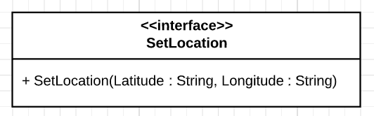

# SetLocation



This interface holds one action : `SetLocation`

Input arguments : 
- `Latitude`, String, should be a double between -90.0 and 90.0 / *Example : 45.98553878*
- `Longitude`, String, should be a double between -180.0 and 180.0 / *Example : -97.98553878*

## Requiring this interface

```Java

private final String SET_LOCATION = "SetLocation";

private DependencyInjectionService dependencyInjectionService;

public static void main(String[] args) {
    //Component creation
    Map<String, ServiceId> requiredServices = new HashMap<>();
    requiredServices.put(SET_LOCATION, new UDAServiceId(SET_LOCATION));

    LocalService<DependencyInjectionService> dependencyInjectionLocalService = 
            ServiceFactory.makeDependencyInjectionService(requiredServices);

    dependencyInjectionService = dependencyInjectionLocalService.getManager().getImplementation();

    UpnpServiceStore.addLocalDevice(
        DeviceFactory.makeLocalDevice(
            "ExampleComponent",
            "Requires SetLocation",
            1,
            "Manufacturer",
            new LocalService[]{ dependencyInjectionLocalService }
        )
    );

    //Calling the required service
    dependencyInjectionService.getRequired().get(SET_LOCATION).execute(
        SET_LOCATION,
        Map.of(
            "Longitude", "0.0",
            "Latitude", "0.0",
        )
    );

}

```

## Providing this interface

```Java
@UpnpService(
        serviceId = @UpnpServiceId("SetLocation"),
        serviceType = @UpnpServiceType(value = "SetLocation", version = 1)
)
public class ExampleSetLocationService {

    @UpnpStateVariable
    private String latitude = "";

    @UpnpStateVariable
    private String longitude = "";

    @UpnpAction(name = "SetLocation")
    public void setLocation(
            @UpnpInputArgument(name = "Latitude") String latitude,
            @UpnpInputArgument(name = "Longitude") String longitude) {
        this.latitude = latitude;
        this.longitude = longitude;
    }
}
```