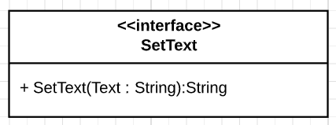

# SetText



This interface holds one action : `SetText`

Input argument : `Text`, String, no conditions.

Output argument : `Ret`, String, no conditions.

## Requiring this interface

```Java

private final String SET_TEXT = "SetText";

private DependencyInjectionService dependencyInjectionService;

public static void main(String[] args) {
    //Component creation
    Map<String, ServiceId> requiredServices = new HashMap<>();
    requiredServices.put(SET_TEXT, new UDAServiceId(SET_TEXT));

    LocalService<DependencyInjectionService> dependencyInjectionLocalService = 
            ServiceFactory.makeDependencyInjectionService(requiredServices);

    dependencyInjectionService = dependencyInjectionLocalService.getManager().getImplementation();

    UpnpServiceStore.addLocalDevice(
        DeviceFactory.makeLocalDevice(
            "ExampleComponent",
            "Requires SetText",
            1,
            "Manufacturer",
            new LocalService[]{ dependencyInjectionLocalService }
        )
    );

    //Calling the required service
    dependencyInjectionService.getRequired().get(SET_TEXT).execute(
        SET_TEXT,
        Map.of("Text","Some text to send"),
        new Consumer<ActionInvocation>() {
            @Override
            public void accept(ActionInvocation actionInvocation) {
                System.out.println("We received the following : " + actionInvocation.getOutput("Ret").toString())
            }
        }
    );

}

```

## Providing this interface

```Java
@UpnpService(
        serviceId = @UpnpServiceId("SetText"),
        serviceType = @UpnpServiceType(value = "SetText", version = 1)
)
public class ExampleSetTextService {

    @UpnpStateVariable
    private String text = null;

    @UpnpAction(name = "SetText", out = @UpnpOutputArgument(name = "Ret"))
    public String setText(@UpnpInputArgument(name = "Text") String text){
        this.text = text;
        return "ok";
    }
}
```